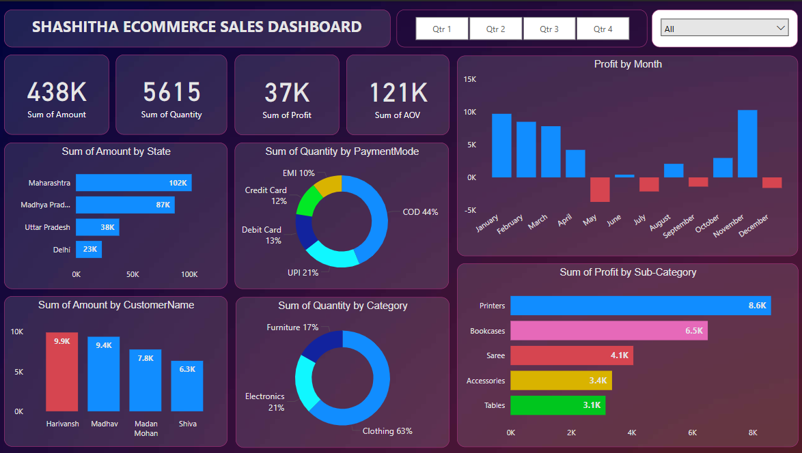

# SHASHITHA ECOMMERCE SALES DASHBOARD 📊🚀

Welcome to the **Shashitha Ecommerce Sales Dashboard**! This is your one-stop visual summary of how our ecommerce platform is performing. Whether you’re a numbers geek 📊 or just curious about sales trends 😉, this dashboard makes it easy for anyone to understand and explore!

---

## What's This Dashboard About?

This dashboard helps us track and analyze:

- **Total Sales** 🛒
- **Quantity Sold** 🎒
- **Profits Made** 🌟
- **Customer Behavior** 🤔

It’s visually intuitive and perfect for anyone—whether you’re a business owner, manager, or just someone learning about ecommerce!

---

## Features At a Glance 🔍

1. **Total Metrics** (Top Row):

   - **Sum of Amount:** 💵 438K
   - **Sum of Quantity:** 👥 5615 units
   - **Sum of Profit:** 💸 37K
   - **Average Order Value (AOV):** 🎮 121K

2. **State-Wise Analysis** 🌍:

   - Maharashtra leads with 102K in sales 🏡
   - Other key states: Madhya Pradesh, Uttar Pradesh, Delhi.

3. **Customer Insights** 👨‍👩‍👦:

   - Top customers: Harivansh (9.9K), Madhav (9.4K).

4. **Payment Modes** 💳:

   - COD (Cash on Delivery): 44%
   - UPI: 21%, Credit Cards: 12%.

5. **Category Trends** 🌂:

   - Top category: Clothing (63% of sales quantity).

6. **Monthly Profit Trends** 🔼:

   - Best months: January, December.
   - Losses? Look out for June, July, and beyond.

7. **Sub-Category Insights** 📦:

   - Printers lead with the highest profits: 8.6K!
   - Other profit-makers: Bookcases, Sarees, and Tables.

---

## How to Use the Dashboard?

1. **Interactive Filters** 🔢:

   - Switch between quarters (Q1, Q2, etc.) to analyze trends by time.
   - Use the dropdown to filter specific views (All/Specific data).

2. **Hover Over Charts** 🕹️:

   - Hover on bar charts, pie charts, and graphs for detailed info.

3. **Understand the Visuals** 🎨:

   - Bar Charts = Top Performers.
   - Pie Charts = Percentages of Sales.

---

## Media & Extras! 🎥✨
- **Dashboard Backgroung:** (dark-gradient.jpg)
- **Dashboard Image** 📸

- **Dashboard Walkthrough Video** 🎥
<video width="720" controls>
  <source src="Ecommerce_Sales.mp4" type="video/mp4">
  Your browser does not support the video tag.
</video>
---

## Why is This Dashboard Important? 🌟

- **Spot Trends:** Understand where sales are growing (or dropping).
- **Boost Profits:** Know what’s making money (and what’s not).
- **Customer Focus:** Tailor offerings based on customer behavior.
- **Save Time:** Get insights quickly without manually crunching numbers.

---

